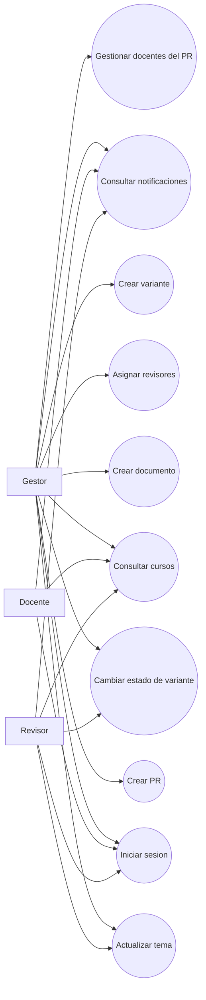
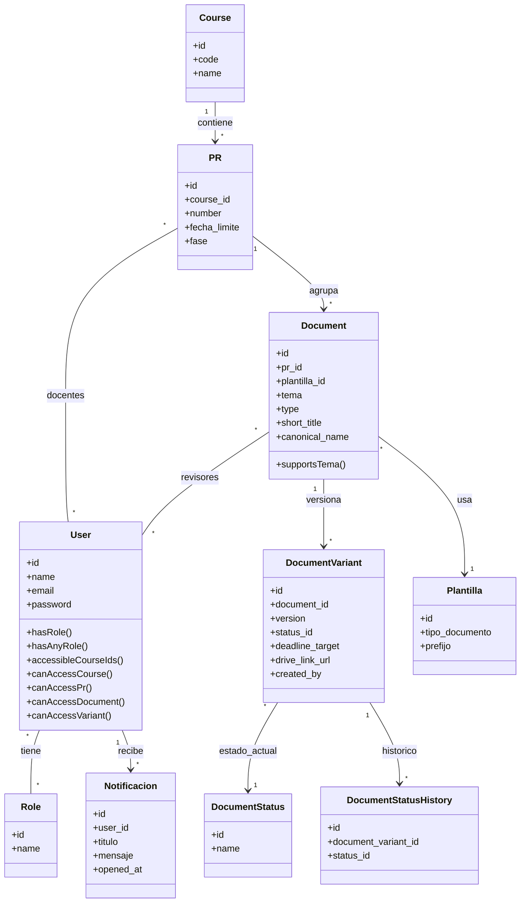
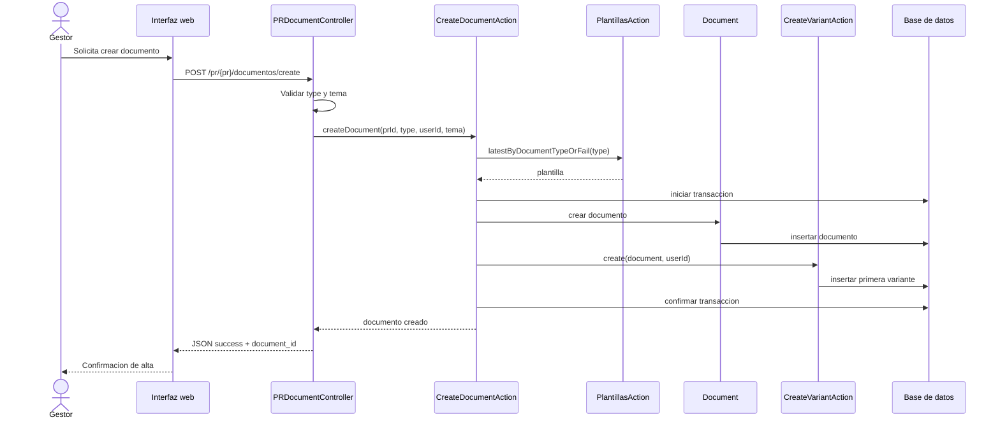
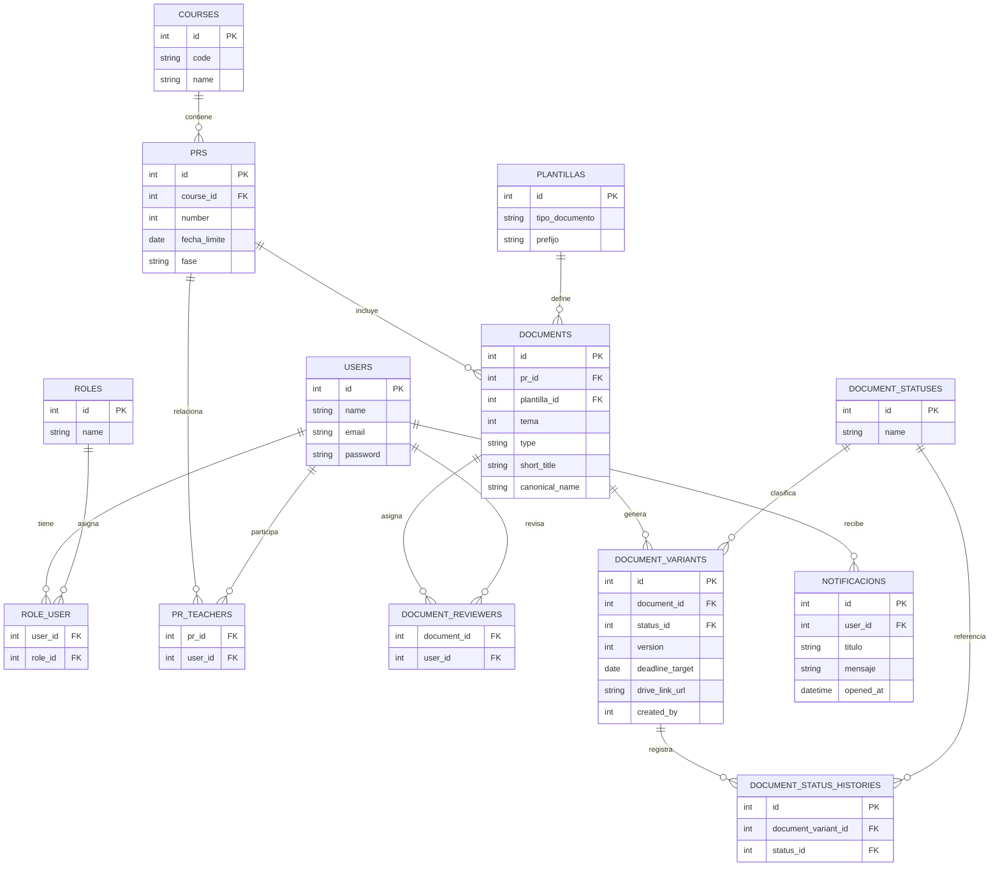

# Diagramas base para la memoria del PFC

## Uso de este documento

Estos diagramas estan pensados como base reutilizable para tu memoria. Puedes copiarlos a Mermaid, Draw.io, PlantUML o a la herramienta que prefieras para generar versiones mas visuales y pulidas.

## 1. Diagrama de casos de uso

## 2. Diagrama de clases UML

## 3. Diagrama de secuencia: crear documento

## 4. Diagrama E-R base

## Recomendacion de uso en la memoria

- usa el diagrama de casos de uso en analisis de requisitos;
- usa el diagrama de clases en diseno estatico;
- usa el diagrama E-R en modelo de datos;
- usa el diagrama de secuencia en diseno estatico o codificacion.

## Siguiente paso recomendado

Convierte estos diagramas en imagenes limpias y anade una breve explicacion debajo de cada uno, indicando que representa, por que es relevante y como se relaciona con el funcionamiento del sistema.