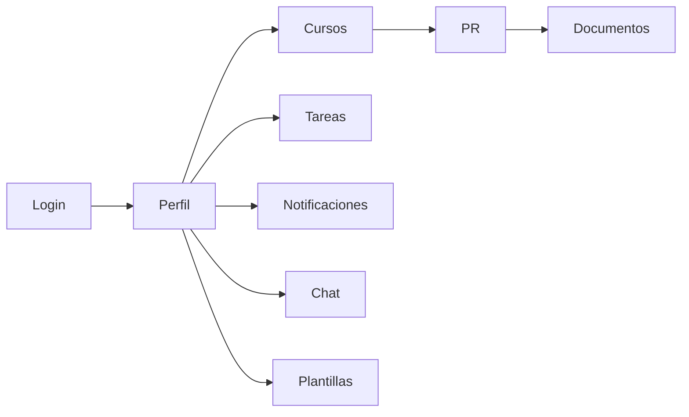
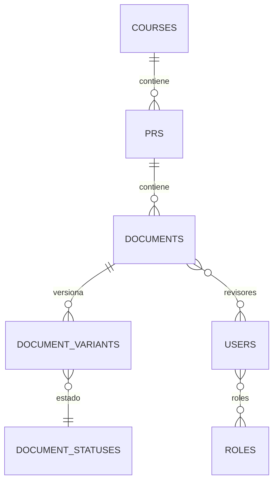

# Presentacion completa de 15 minutos

## 1. Objetivo del documento

Este archivo deja preparada una presentacion completa, equilibrada y defendible para una exposicion de aproximadamente 15 minutos. El contenido esta pensado para poder:

- montarlo directamente en PowerPoint, Canva o Google Slides;
- pasarselo a otra IA para que genere las diapositivas;
- usarlo como guion oral durante la defensa.

La presentacion se centra en los puntos mas importantes del proyecto: problema real, solucion funcional, arquitectura, base de datos, seguridad, logica de negocio, calidad y demo.

## 2. Estructura recomendada

Duracion total objetivo: 15 minutos.

Numero recomendado de diapositivas: 13.

Reparto orientativo del tiempo:

- introduccion y contexto: 2 minutos;
- solucion, usuarios y navegacion: 4 minutos;
- arquitectura y base de datos: 3 minutos;
- seguridad, logica y calidad: 3 minutos;
- graficas, mejoras y cierre: 3 minutos.

## 3. Diapositiva por diapositiva

### Diapositiva 1. Portada

Titulo sugerido:

`Herramienta de gestion de cursos y documentacion academica`

Subtitulo sugerido:

`Proyecto Fin de Ciclo DAM/DAW 2025-2026`

Contenido visible:

- nombre del proyecto;
- tu nombre;
- ciclo formativo;
- curso academico;
- centro.

Que decir oralmente:

"Voy a presentar una aplicacion web desarrollada para centralizar la gestion academica de cursos, proyectos, documentacion, revisiones, tareas, notificaciones y comunicacion interna. La idea principal del proyecto es sustituir un seguimiento disperso por un entorno unico, ordenado y controlado por roles."

Visual recomendado:

- portada limpia con nombre del proyecto;
- captura general del dashboard o fondo relacionado con el sistema.

Tiempo recomendado:

- 30 segundos.

### Diapositiva 2. Contexto y problema

Titulo sugerido:

`Problema que resuelve el proyecto`

Contenido visible:

- gestion documental dispersa;
- seguimiento manual entre correos, carpetas y mensajes;
- dificultad para coordinar gestor, docente y revisor;
- falta de trazabilidad sobre revisiones y estados;
- ausencia de un punto unico para tareas y comunicacion.

Que decir oralmente:

"El proyecto nace de una necesidad real: la informacion estaba repartida entre distintos canales, lo que hacia mas dificil controlar cursos, proyectos, documentos y revisiones. Eso generaba perdida de tiempo, falta de trazabilidad y coordinacion deficiente entre los distintos perfiles implicados."

Visual recomendado:

- comparativa tipo antes y despues;
- iconos de correo, carpetas, hojas de calculo y mensajes en la parte izquierda;
- el sistema centralizado en la parte derecha.

Tiempo recomendado:

- 1 minuto.

### Diapositiva 3. Objetivo y solucion propuesta

Titulo sugerido:

`Objetivo del sistema y solucion funcional`

Contenido visible:

- centralizar la gestion academica en una sola plataforma;
- controlar cursos, PR y documentos;
- mantener trazabilidad documental con variantes y estados;
- priorizar tareas por fecha limite;
- integrar notificaciones y chat interno;
- proteger operaciones segun autenticacion y rol.

Que decir oralmente:

"La solucion propuesta es una aplicacion web que unifica la gestion del trabajo academico. No solo muestra informacion, sino que controla permisos, organiza tareas, mantiene historico documental y facilita la comunicacion entre usuarios dentro del propio sistema."

Visual recomendado:

- diagrama con los modulos: cursos, PR, documentos, tareas, notificaciones, chat.

Tiempo recomendado:

- 1 minuto.

### Diapositiva 4. Tecnologias utilizadas

Titulo sugerido:

`Stack tecnologico`

Contenido visible:

- Laravel 13;
- PHP 8.3;
- Blade + JavaScript;
- Tailwind CSS + Vite;
- SQLite en desarrollo;
- Sanctum para API;
- PHPUnit para pruebas.

Que decir oralmente:

"He utilizado Laravel como framework principal porque permite trabajar de forma solida con rutas, autenticacion, modelos, migraciones, controladores y pruebas. En el frontend se ha usado Blade con apoyo de JavaScript, y para datos y pruebas se ha trabajado en local con SQLite, lo que simplifica la instalacion y la reproducibilidad del proyecto."

Visual recomendado:

- logos de las tecnologias;
- una fila limpia con 6 o 7 tecnologias maximo.

Tiempo recomendado:

- 1 minuto.

### Diapositiva 5. Arquitectura del proyecto

Titulo sugerido:

`Arquitectura aplicada`

Contenido visible:

- patron MVC sobre Laravel;
- controladores para coordinar peticiones;
- modelos Eloquent para datos y relaciones;
- capa `Actions` para logica de negocio reutilizable;
- vistas Blade para la interfaz;
- rutas web y API separadas.

Que decir oralmente:

"La aplicacion sigue una arquitectura MVC, pero reforzada con una capa de acciones de negocio. Esto evita meter demasiada logica en los controladores y mejora la mantenibilidad. De esta forma, la interfaz, el control, la logica y el acceso a datos quedan razonablemente separados."

Visual recomendado:

- esquema por capas: Vista -> Controlador -> Action -> Modelo -> Base de datos.

Tiempo recomendado:

- 1 minuto.

### Diapositiva 6. Tipos de usuario

Titulo sugerido:

`Perfiles del sistema`

Contenido visible:

- gestor: crea y administra cursos, PR, documentos, plantillas y asignaciones;
- docente: consulta PR, documentos y tareas de sus cursos;
- revisor: revisa documentos, variantes y estados asignados.

Que decir oralmente:

"Una parte clave del proyecto es que no todos los usuarios hacen lo mismo. El gestor tiene capacidad de administracion, el docente trabaja sobre los cursos que le corresponden y el revisor participa en el flujo documental. Esto hace que la aplicacion tenga una navegacion y unos permisos realmente adaptados al rol."

Grafica recomendada:

- grafico circular con tres sectores: gestor, docente y revisor;
- el objetivo de la grafica no es mostrar cantidad de usuarios, sino representar la distribucion funcional del sistema por roles.

Tiempo recomendado:

- 1 minuto.

### Diapositiva 7. Navegacion principal de la web

Titulo sugerido:

`Recorrido principal del usuario`

Contenido visible:

- login;
- perfil;
- cursos;
- PR del curso;
- documentos del PR;
- tareas;
- notificaciones;
- chat;
- plantillas.

Que decir oralmente:

"La navegacion empieza en el login y despues pasa al perfil, que actua como pantalla principal. Desde ahi el usuario accede a cursos, PR y documentos, y en paralelo puede revisar tareas, notificaciones, chat y plantillas. La idea es que todo el seguimiento se haga desde un unico entorno."

Visual recomendado:

Tiempo recomendado:

- 1 minuto.

### Diapositiva 8. Modulos funcionales principales

Titulo sugerido:

`Que puede hacer la aplicacion`

Contenido visible:

- gestion de cursos visibles por rol;
- seguimiento de PR por curso;
- creacion y gestion documental;
- variantes y estados con trazabilidad;
- tareas priorizadas por fechas;
- notificaciones internas;
- chat entre usuarios;
- plantillas documentales reutilizables.

Que decir oralmente:

"Aqui se concentra el valor funcional del sistema. No es solo un listado de pantallas: hay gestion real de documentos, flujo de estados, asignaciones, tareas y comunicacion interna. Todo esta orientado a mejorar el seguimiento del trabajo academico."

Grafica recomendada:

- grafico de barras horizontal con los bloques funcionales del sistema;
- categorias: cursos, PR, documentos, variantes, tareas, notificaciones, chat, plantillas.

Tiempo recomendado:

- 1 minuto.

### Diapositiva 9. Base de datos y modelo relacional

Titulo sugerido:

`Base de datos y estructura del dominio`

Contenido visible:

- SQLite en desarrollo y Eloquent como ORM;
- tablas principales: `users`, `roles`, `courses`, `prs`, `documents`, `document_variants`, `document_statuses`, `plantillas`, `notificaciones`, `chat_messages`;
- relacion central del dominio:
- un curso tiene varios PR;
- un PR tiene varios documentos;
- un documento tiene varias variantes;
- cada variante tiene estado actual e historico.

Que decir oralmente:

"La base de datos sigue una jerarquia clara: usuarios con roles, cursos, PR, documentos y variantes documentales. A partir de esa estructura se construyen la trazabilidad de estados, la asignacion de revisores, las notificaciones y el chat."

Visual recomendado:

Tiempo recomendado:

- 1 minuto y 30 segundos.

### Diapositiva 10. Logica de negocio

Titulo sugerido:

`Reglas de negocio que aporta valor`

Contenido visible:

- operaciones diferentes segun rol;
- creacion automatica de variante inicial al crear documento;
- control de estados documentales compatibles;
- asignacion de revisores por documento;
- tareas ordenadas por urgencia;
- notificaciones al cambiar estados o recibir mensajes.

Que decir oralmente:

"Lo importante del proyecto no es solo guardar datos, sino aplicar reglas de negocio. Por ejemplo, al crear un documento se genera una primera variante, los estados documentales se validan para evitar incoherencias y los usuarios solo pueden actuar sobre los recursos que realmente les corresponden."

Visual recomendado:

- lista visual de reglas con iconos;
- o un flujo corto: crear documento -> crear variante -> validar estado -> notificar.

Tiempo recomendado:

- 1 minuto.

### Diapositiva 11. Seguridad y control de acceso

Titulo sugerido:

`Seguridad del sistema`

Contenido visible:

- autenticacion web;
- middleware `auth`;
- middleware por roles;
- comprobaciones de acceso en la logica de negocio;
- API protegida con Sanctum;
- permisos segun relacion real con cursos, PR y documentos.

Que decir oralmente:

"La seguridad no depende solo del menu visible. El sistema protege las rutas mediante autenticacion y roles, y ademas comprueba desde la logica si un usuario puede acceder de verdad a un curso, un PR, un documento o una variante. Esto evita accesos no autorizados aunque un usuario conozca la URL."

Visual recomendado:

- diagrama por capas: Login -> Middleware -> Reglas de negocio -> Recurso autorizado.

Tiempo recomendado:

- 1 minuto.

### Diapositiva 12. Pruebas y calidad del proyecto

Titulo sugerido:

`Calidad, pruebas y mantenibilidad`

Contenido visible:

- pruebas funcionales automatizadas;
- validacion de autenticacion y permisos;
- comprobacion de PR, documentos, tareas, notificaciones, chat y API;
- separacion entre controladores, acciones, modelos y vistas;
- proyecto mantenible y ampliable.

Que decir oralmente:

"Para que el proyecto sea defendible no basta con que funcione visualmente. Tambien se ha trabajado la calidad mediante pruebas automatizadas y separacion de responsabilidades. Esto facilita detectar errores, mantener el codigo y ampliar el sistema en el futuro."

Grafica recomendada:

- grafico de barras con areas cubiertas por pruebas: autenticacion, permisos, PR, documentos, tareas, chat, notificaciones y API.

Tiempo recomendado:

- 1 minuto.

### Diapositiva 13. Mejoras futuras y cierre

Titulo sugerido:

`Mejoras futuras y conclusion`

Contenido visible:

- despliegue sobre motor de base de datos de produccion;
- analitica o panel estadistico avanzado;
- integracion con sistemas externos;
- notificaciones en tiempo real;
- ampliacion de pruebas y auditoria;
- mejora continua de experiencia de usuario.

Frase final visible:

`El proyecto centraliza gestion, trazabilidad y comunicacion en una sola plataforma.`

Que decir oralmente:

"Como conclusion, el proyecto resuelve un problema real de organizacion academica y documental. La aplicacion unifica seguimiento, control de estados, tareas, notificaciones y comunicacion interna. Ademas, se ha construido con una base tecnica suficientemente mantenible como para seguir creciendo."

Visual recomendado:

- cierre limpio con 3 palabras clave: centralizacion, trazabilidad, coordinacion.

Tiempo recomendado:

- 1 minuto.

## 4. Diapositiva opcional de demo

Si vas a hacer demostracion en directo, añade una diapositiva muy breve antes del cierre o al final.

Titulo sugerido:

`Demo funcional`

Contenido visible:

1. login como gestor;
2. perfil y ajustes;
3. cursos y PR;
4. documentos y variantes;
5. tareas;
6. notificaciones;
7. chat.

Que decir oralmente:

"Para terminar, voy a enseñar un recorrido corto por la aplicacion para ver como estas piezas tecnicas se traducen en funcionalidad real."

Tiempo recomendado:

- 2 o 3 minutos, ajustando el resto de la exposicion.

## 5. Graficas recomendadas

Para una presentacion de 15 minutos, tres graficas son suficientes. No metas mas porque restan claridad.

### Grafica 1. Distribucion funcional por roles

Tipo:

- grafico circular.

Etiquetas:

- gestor;
- docente;
- revisor.

Objetivo:

- explicar que la aplicacion no esta pensada para un usuario unico, sino para tres perfiles con responsabilidades distintas.

Texto de apoyo:

"El sistema distribuye funciones segun el rol, lo que permite restringir operaciones y adaptar la navegacion a cada perfil."

### Grafica 2. Modulos funcionales implementados

Tipo:

- grafico de barras horizontal.

Etiquetas:

- cursos;
- PR;
- documentos;
- variantes;
- tareas;
- notificaciones;
- chat;
- plantillas.

Objetivo:

- mostrar de forma visual la amplitud funcional del proyecto.

Texto de apoyo:

"La aplicacion cubre desde la estructura academica principal hasta el seguimiento, la comunicacion y la reutilizacion documental."

### Grafica 3. Flujo principal del sistema

Tipo:

- diagrama de flujo.

Flujo recomendado:

- login -> perfil -> cursos -> PR -> documentos -> variantes -> estado -> notificacion/chat.

Objetivo:

- enseñar el recorrido logico del usuario y la conexion entre modulos.

Texto de apoyo:

"El proyecto no son modulos aislados, sino un flujo integrado de trabajo academico y documental."

## 6. Orden final si quieres hacer demo en vivo

Si tu profesor valora mas ver la aplicacion que la teoria, usa este orden:

1. portada;
2. contexto;
3. objetivo y solucion;
4. tecnologias;
5. arquitectura;
6. roles;
7. navegacion;
8. modulos;
9. base de datos;
10. seguridad y logica de negocio;
11. pruebas y calidad;
12. demo;
13. mejoras futuras y cierre.

## 7. Guion de cierre final

Texto recomendado para terminar:

"En resumen, este proyecto convierte un seguimiento academico disperso en una plataforma unica, con control de acceso, trazabilidad documental, tareas priorizadas y comunicacion interna. Creo que el valor principal no esta solo en haber desarrollado una web funcional, sino en haber construido un sistema coherente, mantenible y alineado con una necesidad real."

## 8. Instruccion lista para otra IA

Si quieres pasar este archivo a otra IA para que te genere la presentacion visual, puedes darle esta instruccion:

`Genera una presentacion profesional de 13 diapositivas basada exactamente en este documento. Mantén un estilo academico moderno, usa poco texto por diapositiva, destaca visualmente arquitectura, base de datos, roles y graficas, y conserva el orden y los mensajes clave.`